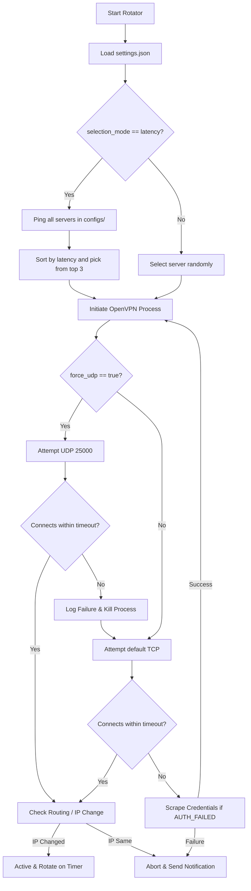

# VPN Rotator Windows

A robust, dependency-free local network utility written in Python that controls the OpenVPN client on Windows. It automatically rotates VPN servers, selects the lowest-latency nodes, fetches credentials dynamically, and alerts you of status changes using Windows desktop notifications.

---

## Key Features

1. **Zero-Wait Connection**: Instead of using a fixed sleep timer, the manager monitors OpenVPN log outputs in real-time, completing the connection sequence the instant the tunnel is ready (typically in 3–8 seconds).
2. **Automated Credentials Scraper**: Automatically scrapes active usernames and passwords from `vpnbook.com/freevpn/openvpn` if the connection fails due to expired credentials (`AUTH_FAILED`).
3. **Latency-Based Selection**: Probes all `.ovpn` configurations in your `configs/` folder and selects node options from the lowest-ping servers to maximize browsing speeds.
4. **UDP Protocol with TCP Fallback**: Attempts connections via high-speed UDP (port `25000`) first, automatically reverting to standard TCP if the UDP port is blocked by firewalls or network rules.
5. **IP Leak & Routing Verification**: Captures your public IP before and after connecting, asserting that they are different. If routing table updates fail, the connection is instantly aborted to prevent IP leakage.
6. **Windows Desktop Notifications**: Native balloon and action-center toast notifications alert you when the VPN connects, rotates, fails, or disconnects.

---

## Tech Stack & Dependencies

*   **Language**: Python 3.10+ (Standard Library only - **Zero external pip package dependencies required!**)
*   **VPN Engine**: OpenVPN 2.6+ / 2.7+ client installed locally.
*   **System integration**: Windows PowerShell (harnesses `System.Windows.Forms` for lightweight background notifications).

---

## Folder Structure

```text
vpn_test/
├── configs/            # Directory containing your .ovpn server profiles
├── logs/               # Directory where OpenVPN and rotator logs are written
├── vpnrotator/         # Core python package modules
│   ├── cli.py          # Command line interface and parser
│   ├── config_loader.py# Loads settings and measures server ping latencies
│   ├── credentials.py  # Website scraper to fetch VPNBook passwords
│   ├── ip_check.py     # Public IP lookup utility
│   ├── logging_setup.py# Setup log files and formatting
│   ├── notification.py # PowerShell wrapper for Windows toast notifications
│   ├── scheduler.py    # Manages periodic VPN server rotation
│   └── vpn_manager.py  # Launches OpenVPN processes and monitors logs
├── README.md           # This documentation file
├── main.py             # Script entry point
├── settings.json       # Rotator configuration parameters
└── auth.txt            # Cached VPN credentials (username and password)
```

---

## Architecture Flow

The following diagram illustrates how the VPN Rotator starts, connects, checks latency, and fallbacks to TCP:



---

## Setup & Prerequisites

### 1. Requirements
*   **Windows OS**.
*   **OpenVPN** installed locally (Default path: `C:\Program Files\OpenVPN\bin\openvpn.exe`).
*   Put `.ovpn` configuration profiles in the `configs/` folder.

### 2. Privilege Setup
To allow OpenVPN to create virtual network interfaces and modify your system routing table without requiring you to run your command prompt as Administrator every time, you should start the **OpenVPN Interactive Service**:

1. Open **PowerShell as Administrator** (right-click and choose **Run as Administrator**).
2. Run the following commands:
   ```powershell
   Start-Service OpenVPNServiceInteractive
   Set-Service OpenVPNServiceInteractive -StartupType Automatic
   ```
*(Alternatively, you can just execute the python commands from an elevated Administrator terminal).*

---

## Configuration (`settings.json`)

You can customize the behavior by editing `settings.json`:

| Parameter | Type | Default | Description |
| :--- | :--- | :--- | :--- |
| `openvpn_path` | `string` | `C:\\Program Files\\...` | Path to the `openvpn.exe` executable. |
| `configs_dir` | `string` | `configs` | Directory containing `.ovpn` config files. |
| `auth_file` | `string` | `auth.txt` | File where credentials will be written/read. |
| `logs_dir` | `string` | `logs` | Directory where logs are saved. |
| `rotation_seconds`| `int` | `1800` (30 mins) | Time interval before rotating to another server. |
| `selection_mode` | `string` | `"latency"` | `"latency"` (fastest server first) or `"random"`. |
| `avoid_same_server`| `bool` | `true` | Prevent reconnecting to the same server. |
| `connect_timeout_seconds`| `int`| `25` | Maximum seconds allowed to establish a connection. |
| `public_ip_check` | `bool` | `true` | Verify public IP change post-connection. |
| `force_udp` | `bool` | `true` | Force connection through UDP first with TCP fallback. |

---

## Command Usage

Run all commands through `main.py`:

### Start Automatic Rotation
Starts the scheduler. It will connect to the fastest server, notify you, and rotate servers automatically according to the configured interval.
```powershell
python main.py start
```

### Stop VPN
Terminates the active OpenVPN connection safely, resets routing tables, and clears active state.
```powershell
python main.py stop
```

### Check Current Status
Displays the current connection status, active server configuration, OpenVPN process ID, connect time, public IP, and the time remaining before the next rotation.
```powershell
python main.py status
```

### Force Rotation
Immediately disconnects the active server and rotates to a new, fast VPN server without waiting for the timer to expire.
```powershell
python main.py rotate
```

### Run Once (Single Session)
Connects to the fastest server and keeps the connection alive without starting the rotation scheduler.
```powershell
python main.py once
```

### List Available Servers
Lists all `.ovpn` configuration profiles present in your `configs/` directory.
```powershell
python main.py list
```
