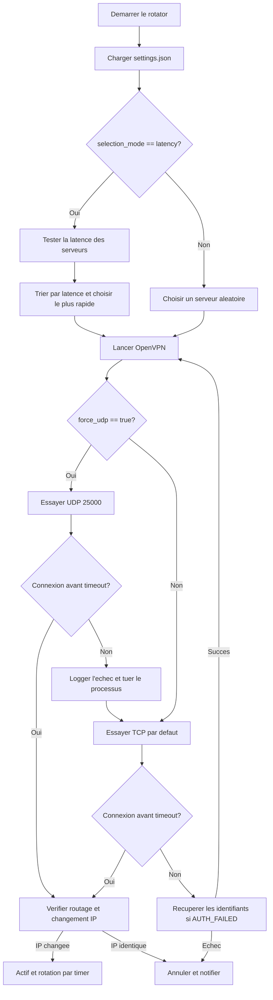

# VPN Rotator Windows

Un utilitaire réseau local robuste, écrit en Python, sans dépendances externes obligatoires. Il contrôle le client OpenVPN sous Windows, change automatiquement de serveur VPN, sélectionne les serveurs avec la latence la plus faible, récupère les identifiants VPNBook si nécessaire, et affiche des notifications Windows lors des changements d'état.

---

## Fonctionnalités principales

1. **Connexion sans attente fixe** : au lieu d'utiliser un simple délai statique, le gestionnaire surveille les logs OpenVPN en temps réel et détecte immédiatement quand le tunnel est prêt, généralement en quelques secondes.
2. **Récupération automatique des identifiants** : si la connexion échoue à cause d'identifiants expirés (`AUTH_FAILED`), le programme récupère les identifiants actifs depuis `vpnbook.com/freevpn/openvpn` et met à jour `auth.txt`.
3. **Sélection par latence** : le programme teste les fichiers `.ovpn` du dossier `configs/` et choisit le serveur avec la latence la plus faible.
4. **UDP avec fallback TCP** : il tente d'abord une connexion UDP sur le port `25000`, puis revient automatiquement au TCP si l'UDP est bloqué ou échoue.
5. **Vérification de routage et fuite IP** : il compare l'IP publique avant et après connexion. Si l'IP ne change pas, la connexion est annulée pour éviter que le trafic sorte sans VPN.
6. **Notifications Windows** : des notifications de bureau signalent les connexions, déconnexions, rotations et erreurs.
7. **Exécution en arrière-plan** : `start` lance le rotator en arrière-plan. Le terminal peut être fermé; le VPN reste actif jusqu'à `stop`.

---

## Technologies et dépendances

- **Langage** : Python 3.10+.
- **Dépendances Python** : bibliothèque standard uniquement.
- **Moteur VPN** : client OpenVPN 2.6+ ou 2.7+ installé localement.
- **Intégration Windows** : PowerShell et `System.Windows.Forms` pour les notifications légères.

---

## Structure du projet

```text
vpn_test/
|-- configs/             # Fichiers .ovpn des serveurs
|-- logs/                # Logs OpenVPN et rotator, ignores par Git
|-- vpnrotator/          # Package Python principal
|   |-- cli.py           # Interface en ligne de commande
|   |-- config_loader.py # Chargement config + mesure de latence
|   |-- credentials.py   # Recuperation des identifiants VPNBook
|   |-- ip_check.py      # Verification de l'IP publique
|   |-- logging_setup.py # Configuration des logs
|   |-- notification.py  # Notifications Windows via PowerShell
|   |-- scheduler.py     # Rotation periodique des serveurs
|   `-- vpn_manager.py   # Lancement et surveillance d'OpenVPN
|-- README.md            # Documentation
|-- main.py              # Point d'entree
|-- settings.json        # Configuration du rotator
`-- auth.txt             # Identifiants locaux, ignores par Git
```

---

## Flux de fonctionnement

Le diagramme suivant résume le démarrage, le choix du serveur, la tentative UDP, le fallback TCP et la vérification du routage :



---

## Installation et prérequis

### 1. Prérequis

- Windows.
- OpenVPN installé localement.
- Chemin par défaut attendu :

```powershell
C:\Program Files\OpenVPN\bin\openvpn.exe
```

- Fichiers `.ovpn` placés dans le dossier `configs/`.

### 2. Droits administrateur

OpenVPN doit pouvoir créer une interface réseau virtuelle et modifier la table de routage Windows. Deux options sont possibles.

Option recommandée : activer le service interactif OpenVPN.

1. Ouvre PowerShell en administrateur.
2. Exécute :

```powershell
Start-Service OpenVPNServiceInteractive
Set-Service OpenVPNServiceInteractive -StartupType Automatic
```

Autre option : lancer les commandes Python depuis un terminal ouvert en administrateur.

---

## Configuration (`settings.json`)

Tu peux modifier le comportement dans `settings.json`.

| Paramètre | Type | Défaut | Description |
| :--- | :--- | :--- | :--- |
| `openvpn_path` | `string` | `C:\\Program Files\\...` | Chemin vers `openvpn.exe`. |
| `configs_dir` | `string` | `configs` | Dossier contenant les fichiers `.ovpn`. |
| `auth_file` | `string` | `auth.txt` | Fichier local des identifiants VPN. |
| `logs_dir` | `string` | `logs` | Dossier des logs. |
| `rotation_seconds` | `int` | `1800` | Intervalle avant rotation, en secondes. |
| `selection_mode` | `string` | `"latency"` | `"latency"` pour choisir le plus rapide, ou `"random"`. |
| `avoid_same_server` | `bool` | `true` | Évite de reprendre le même serveur à la rotation suivante. |
| `connect_timeout_seconds` | `int` | `25` | Timeout de connexion TCP. |
| `udp_connect_timeout_seconds` | `int` | `8` | Timeout de tentative UDP avant fallback TCP. |
| `public_ip_check` | `bool` | `true` | Vérifie que l'IP publique change après connexion. |
| `force_udp` | `bool` | `true` | Tente l'UDP avant le TCP. |

---

## Commandes

Toutes les commandes se lancent depuis `main.py`.

### Démarrer la rotation automatique

Lance le rotator en arrière-plan. Après cette commande, tu peux fermer le terminal : le rotator et le VPN continuent de tourner jusqu'à `stop`.

```powershell
python main.py start
```

### Arrêter le VPN

Arrête d'abord le rotator en arrière-plan, puis déconnecte OpenVPN et nettoie l'état local.

```powershell
python main.py stop
```

Pour l'utilisation normale, ces deux commandes suffisent :

```powershell
python main.py start
python main.py stop
```

### Vérifier l'état

Affiche l'état courant : serveur actif, PID OpenVPN, heure de connexion, IP publique et temps restant avant la prochaine rotation.

```powershell
python main.py status
```

### Forcer une rotation

Déconnecte immédiatement le serveur actuel et reconnecte un nouveau serveur rapide sans attendre la fin du timer.

```powershell
python main.py rotate
```

### Connexion unique

Connecte le serveur le plus rapide sans démarrer le scheduler de rotation.

```powershell
python main.py once
```

### Lister les serveurs

Liste tous les fichiers `.ovpn` disponibles dans `configs/`.

```powershell
python main.py list
```

---

## Sécurité Git

Les fichiers locaux sensibles ou temporaires sont ignorés par Git :

```text
auth.txt
logs/
vpn_state.json
rotator_state.json
test_scraper.py
```

Ne commit jamais `auth.txt`, les logs ou les fichiers d'état runtime.
